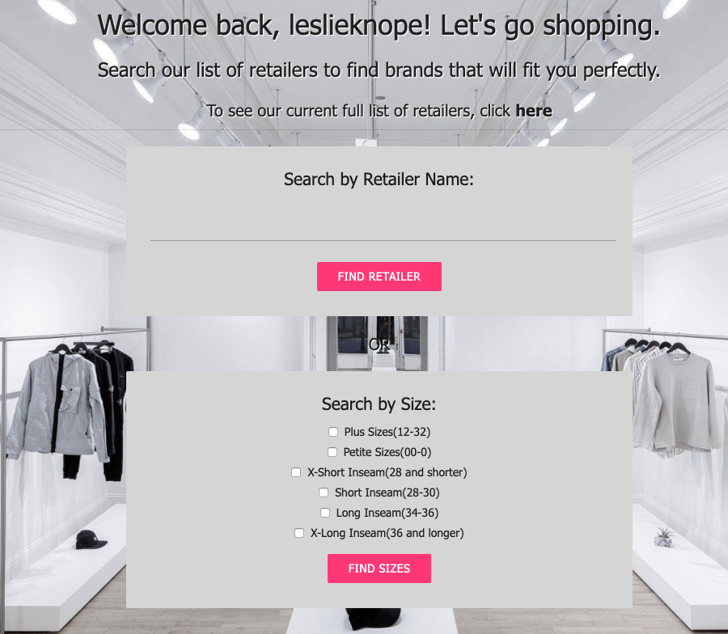
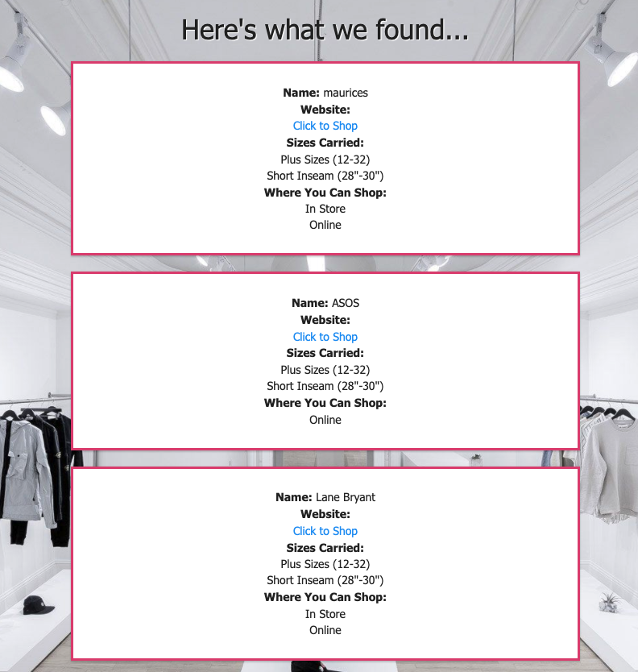
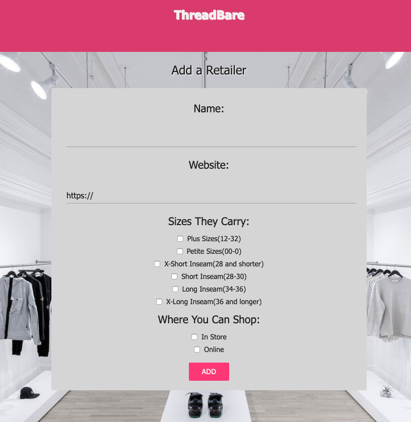

# ThreadBare

*Duration: 2 Week Sprint*

ThreadBare is a web-based application geared towards shoppers who wear sizes that lie outside of what is considered "standard sizing". This includes plus size, petite size, short, and long inseams. Users have the ability to search for retailers that carry their size, and can even contribute any retailers that carry the aforementioned types of sizes.

To see the site, please visit: [ThreadBare](https://fierce-crag-17582.herokuapp.com/#/home)

## Screenshots

## Prerequisites

Before you get started, make sure you have the following software installed on your computer:

- [Node.js](https://nodejs.org/en/)
- [PostrgeSQL](https://www.postgresql.org/)
- [Nodemon](https://nodemon.io/)

## Installation

1. Create a database called `threadbare_database`. The database.sql file in this project contains the query text necessary to create the required tables for this app
2. Run an `npm install`
3. Create a `.env` file at the root of the project and include this line in the file:

    SERVER_SESSION_SECRET=

    **Note:** To ensure the security of the app, you must include a lengthy string of varying letters and numbers as your `SERVER_SESSION_SECRET`. Failure to complete this step will result in a warning from the server.
4. Start postgres if it is not running already by using `brew services start postgresql`
5. Run an `npm run server`
6. Run an `npm run client`
7. The previous command will prompt the app to open on a browser window.

## Usage
1. From the home page, you can search either by entering a particular retailer name, or by selecting one or more sizes.
2. From the search results page, you can view all applicable retailers to your search criteria. Each retailer listing includes a link to the retailer's website so that you can begin shopping right away.
3. If you notice an error with any particular retailers, a link is provided at the bottom of the search results list for you to submit an edit request.
4. To complete an edit request, include the retailer name, select an issue type from the dropdown menu, and add further detail in the text area below.
5. You can access the Add a Retailer page from links at the bottom of the search results page and from a button in the nav bar.
6. To add a retailer, include the retailer name, website, sizes the retailer carries, and where you can shop the retailer.

## Built With
1. React
2. Node.js
3. Express
4. PostgreSQL
5. Redux-Saga
6. MUI CSS

## Acknowledgement
Thank you to Prime Digital Academy and the Dijkstra cohort for supporting me and making this app a reality.

## Support
For questions please email me at aescott87@gmail.com
